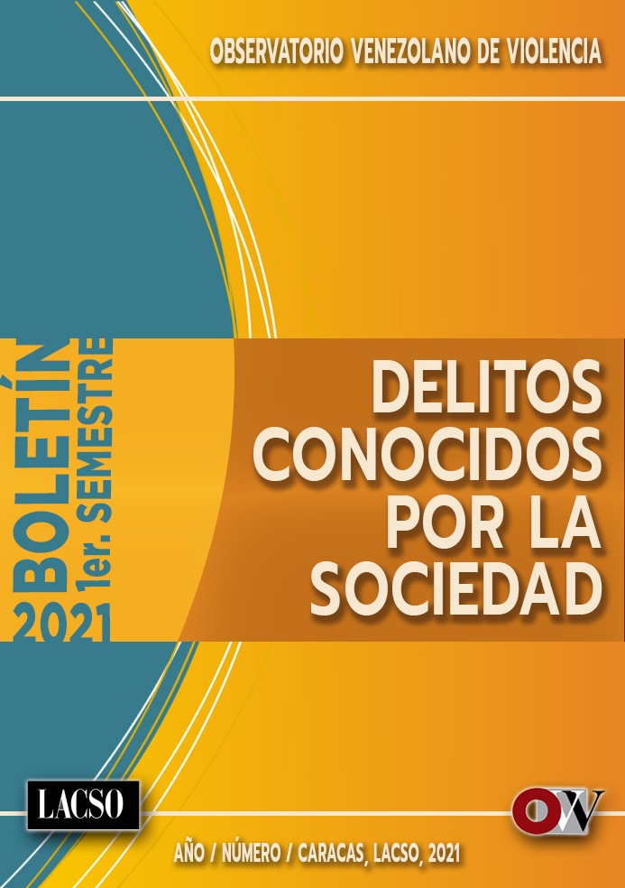

--- 
title: "Boletín primer semestre de 2021"
author: "LACSO-OVV"
date: ""
site: bookdown::bookdown_site
output: bookdown::gitbook
documentclass: book
bibliography: [book.bib, packages.bib]
biblio-style: apalike
csl: apa.csl
link-citations: yes
github-repo: rstudio/bookdown-demo
description: ""
cover-image: "images/PORTADA_BOLETIN_SEMESTRAL2.jpg"

---

```{r officedown, include=FALSE}
library(officedown)
library(officer)

```



# LACSO-OVV {-}


```{r fig.align='center', echo=FALSE, include=identical(knitr:::pandoc_to(), 'html'), fig.link='https://observatoriodeviolencia.org.ve/news/informe-semestral-regional-de-violencia-2021-guarico/'}
knitr::include_graphics('images/PORTADA_BOLETIN_SEMESTRAL2.jpg', dpi = NA)
```

```{r victimasdelhiedadsexo, results='hide',echo=FALSE,message=FALSE, warning=FALSE,cache=F}
source("victimasdelito.R", echo = F,local = knitr::knit_global())
```

```{r sucesos, results='hide',echo=FALSE,message=FALSE, warning=FALSE,cache=F}
source("sucesos.R", echo = F,local = knitr::knit_global())
```

```{r victimasmil, results='hide',echo=FALSE,message=FALSE, warning=FALSE,cache=F}
source("victimasMIL.R", echo = F,local = knitr::knit_global())
```

<!--chapter:end:index.Rmd-->


# Presentación

<!---BLOCK_MULTICOL_START--->


Nos complace presentarles el primer número del Boletín del Observatorio de Prensa del Observatorio Venezolano de Violencia (OVV). Este Boletín es el esfuerzo del trabajo de recolección, sistematización, análisis e interpretación de las noticias de sucesos violentos reportados en la prensa escrita y digital tanto estadal como nacional, por los 15 equipos de trabajo que hacen parte de las sedes de los Observatorios Regionales presentes en los estados: Amazonas Aragua, Bolívar, Carabobo Falcón, Guárico, Lara, Mérida, Monagas, Nueva Esparta, Región Capital, Sucre, Táchira, Trujillo y Zulia.

La información que aquí presentamos no son todos los delitos sobre violencia interpersonal ocurridos durante el primer semestre del año 2021, sino aquellos que fueron reportados en la prensa nacional y regional disponible y consultada, considerando la falta de muchos medios que por diversas razones han cesado, o por la censura que pesa sobre ellos y les impide cubrir o informar a la sociedad. Esta información extraída de la prensa fue procesada bajo una metodología de trabajo que implica la organización de la información recabada en un instrumento cuyas preguntas pretenden caracterizar los delitos, para posteriormente ser catalogados, de acuerdo con la Clasificación Internacional de Delitos con Fines Estadísticos de la Oficina de las Naciones Unidas contra la Droga y el Delito [@UNODC2015]. 

<!---BLOCK_MULTICOL_STOP{widths: [3,3], space: 0.2, sep: true}--->

<!--chapter:end:00-presentacion.Rmd-->


# Lo observado 

<!---BLOCK_MULTICOL_START--->

La observación y análisis de los datos obtenidos por el Observatorio de Prensa, de las noticias aparecidas en los medios consultados en el primer semestre del año 2021, permiten presentar las diferentes expresiones de la violencia interpersonal y su caracterización, como parte de los cambios sociales que experimenta la sociedad venezolana, debido a la situación económica, política y a aquellos generados por la pandemia producida por la presencia del covid-19.

Esta caracterización muestra tendencias que hacen pensar en algunos cambios que se han producido en los delitos violentos cometidos durante el primer semestre de año 2021, en comparación con el mismo periodo del año 2020. La cobertura de la prensa en las diferentes sedes del OVV aporta información que da cuenta de la disminución de los homicidios intencionales, y el aumento de otros delitos menos letales como las agresiones y los robos. La violencia delincuencial produce más víctimas que la violencia por intervención policial y siguen siendo los hombres jóvenes los más afectados por esta violencia, en lugares fuera del hogar; aunque no hay que desestimar el aumento del números de mujeres jóvenes, niñas y adolescentes víctimas tanto de feminicidios como de violaciones sexuales y otro tipo de agresiones sexuales, dentro del ámbito del hogar.

Las medidas de confinamiento y desmovilización de la población, han hecho lo propio para propiciar el recrudecimiento de los conflictos familiares, lo que ha afectado las relaciones entre sus miembros, al punto de incitar hechos de violencia que prácticamente mantiene en convivencia al sexo femenino con su principales victimarios que son miembros de la familia, siendo en la mayoría de los casos esposo, ex esposo, padres, abuelos, aumentando los casos reportados de feminicidios, así como violaciones y agresiones sexuales. Aunado a ello existe desconocimiento por un lado, y falta de apoyo por el otro, a las víctimas de estos delitos, que hacen más difícil el control y registro de este tipo de delitos.

Una hipótesis para explicar estas tendencias en el comportamiento de la violencia, que apunta hacia el incremento de casos de violencia que ocurren en ambientes cerrados y privados y disminución de hechos violentos en lugares abiertos y públicos, sin duda tiene que ver, a pesar de los conflictos sociales e inestabilidad política, con factores como la migración de venezolanos a otros países, la destrucción de la economía y del trabajo, las medidas de confinamiento producto de la cuarentena por la pandemia del covid-19, la reducción de delincuentes producto de acciones extrajudiciales por parte de organismos de seguridad, las oportunidades de delitos a pequeñas escalas y más discretas dada la dolarización de actividades económicas, tanto en pequeños comercios como en la economía informal [@LACSO-OVV2020]. A todo ello se suma la violencia estructural producida por la precariedad de los servicios públicos y las acciones de omisión y ausencia de políticas públicas que profundizan la crisis humanitaria y viola los derechos humanos de los ciudadanos.

<!---BLOCK_MULTICOL_STOP{widths: [3,3], space: 0.2, sep: true}--->


<!--chapter:end:01-intro.Rmd-->


\newpage 

# Violencia letal

## Homicidio intencional

<!---BLOCK_MULTICOL_START--->

Entendiendo el homicidio intencional como la “muerte ilícita causada a una persona con la intención de causarle la muerte u ocasionarle lesiones graves” [@UNODC2015,19], no cabe duda de que este delito sigue siendo de los más graves que se cometen y son reportados por la prensa consultada. Para este primer semestre del año 2021 la prensa nacional y regional consultada, registró un total de 652 muertes por homicidio intencional, de los cuales sólo se tuvo información sobre edad y sexo en 468 casos. 

```{r victimasmilpiramide, results='hide',echo=FALSE,message=FALSE, warning=FALSE,cache=F}
source("victimasmil_edadsexo_piramide.R", echo = F,local = knitr::knit_global())
```

```{r victimasdelhipiramide, results='hide',echo=FALSE,message=FALSE, warning=FALSE,cache=F}
source("victimasdelhi_edadsexo_piramide.R", echo = F,local = knitr::knit_global())
```

```{r victimasdelhimotivpiramide, results='hide',echo=FALSE,message=FALSE, warning=FALSE,cache=F}
source("victimasdelhi_motivacion_piramide.R", echo = F,local = knitr::knit_global())
```

```{r victimasdelhisexoedadpir, echo=FALSE, fig.width = 3, fig.asp = 0.7,out.width='90%',warning=FALSE,cache=F,fig.cap = 'Número víctimas por homicidio intencional discriminadas según edad y sexo.'}
par(mar = c(4, 4, 0.1, 0.1))
knitr::include_graphics(c("images/victimasdelhi_piramide.png"))
# par(mar = c(4, 4, 0.1, 0.1))
# plot(a)
# plot(sucesospol_barras)
```

Así puede observarse en el Gráfico \@ref(fig:victimasdelhisexoedadpir) que este delito discriminado por edad y sexo muestra lo que ha sido una tendencia en el país y en Latinoamérica, y son las muertes de hombres jóvenes menores de 30 años, pero también puede notarse que durante el periodo en estudio fueron recogidos mayoritariamente por la prensa el homicidio al sexo femenino en edades entre 11 y 25 años, fundamentalmente el grupo entre adolescentes de 11 a 15 años. Y aunque con las menores proporciones también sucedió con octogenarias y menores de 1 año de edad. 

Esto merece atención por cuanto al ver en el Gráfico \@ref(fig:victimasdelhimotiv), las motivaciones para estos delitos discriminados por sexo, nos muestra que en los 446 donde se pudo obtener esta información, las causas reportadas para el caso de las mujeres, son las que tienen que ver con el género, y otras motivaciones, entre las cuales se menciona los conflictos intrafamiliares; mientras que para los hombres predominan como motivaciones los ajustes de cuentas, el provecho ilícito y la venganza. Se pone en evidencia entonces el hecho de que dado que las mujeres están más tiempo en casa por el rol que socialmente le ha sido asignado, se encuentra en mayor riesgo de ser victimizada dentro del hogar, al contrario de lo que sucede con el sexo masculino, quien ejerce sus funciones fundamentalmente fuera del hogar.

```{r victimasdelhimotiv, echo=FALSE, fig.width = 3, fig.asp = 0.7,out.width='90%',warning=FALSE,cache=F,fig.cap = 'Número víctimas por homicidio intencional discriminadas según el sexo y la motivación del delito.'}
par(mar = c(4, 4, 0.1, 0.1))
knitr::include_graphics(c("images/victimasdelhimotiv_graf.png"))
# par(mar = c(4, 4, 0.1, 0.1))
# plot(a)
# plot(sucesospol_barras)
```

<!---BLOCK_MULTICOL_STOP{widths: [3,3], space: 0.2, sep: true}--->

<br>

## Muertes por intervención policial (MIP)

<!---BLOCK_MULTICOL_START--->

Las muertes por intervención policial informadas durante el primer semestre  del 2021, en los reportes de prensa consultados, alcanzan un total de 562 víctimas (gráfico \@ref(fig:victimasmilsexoedadpir)). Sin embargo, de ese total la prensa solo mencionó en 207 casos información de edad y sexo de las víctimas, entre las cuales 60 son de sexo masculino, en edades comprendidas entre 20 y 30 años, aunque llama la atención que también se reportaron víctimas de menos de un año y de 70 años, que, aunque en mucha menor proporción, intriga la muerte de varones de esas edades en manos de la policía. La muerte de mujeres por funcionarios policiales es mucho menor que los hombres, siendo las víctimas mayores de 20 años las más afectadas. 

```{r sucesospolbarras, results='hide',echo=FALSE,message=FALSE, warning=FALSE,cache=F}
source("sucesospolBarras.R", echo = F,local = knitr::knit_global())
```

```{r victimasmilsexoedadpir, echo=FALSE,fig.width = 3, fig.asp = 0.7,out.width='90%',warning=FALSE,cache=F,fig.cap = 'Número de muertes por intervención policial discriminados por edad y sexo.'}
par(mar = c(4, 4, 0.1, 0.1))
knitr::include_graphics(c("images/victimasmilsexoedad_piramide.png"))
# par(mar = c(4, 4, 0.1, 0.1))
# plot(a)
# plot(sucesospol_barras)
```

Las cifras de víctimas del sexo femenino es inferior, y puede deberse a que  son las menos expuestas, aunque el hecho de que sean mayores de 20 años, pueden dar cuenta de víctimas que se mueven fuera del hogar por razones de trabajo o estudio, o son victimizadas por policías por estar en involucradas en delitos o estar en lugares cercanos donde funcionarios policiales realizaron sus acciones.

El desglose de los organismos policiales vinculados a los homicidios reportados en prensa (gráfico \@ref(fig:sucesosmil)), indica que, en los 465 casos conocidos, por lo menos en 160 sucesos, estuvo involucrada la policía estadal con 35%, seguidos por la PNB y el CICPC en casi 100 casos cada uno, para un 20% respectivamente, siendo los cuerpos menos involucrados la policía municipal y las FANB. Aquí puede apreciarse como ha disminuido el protagonismo de la PNB, especialmente del grupo FAES, quien ha recibido innumerables acusaciones y denuncias tanto dentro del territorio nacional, como a nivel internacional sobre todo por las denuncias en los informes de la Alta Comisionada de las Naciones Unidas para los Derechos Humanos, Michelle Bachelet, lo que ha obligado al gobierno a pensar la política de represión implementada a través de este grupo comando e incluso del CICPC, cuerpo de investigación que se ha visto muy involucrado en casos de homicidios, sobre todo de ejecuciones extrajudiciales.

```{r sucesosmil, echo=FALSE,fig.width = 3, fig.asp = 0.7,out.width='90%',warning=FALSE,cache=F,fig.cap = 'Número y proporción de sucesos asociados a muertes por intervención policial discriminados según el cuerpo de seguridad involucrado.'}
par(mar = c(4, 4, 0.1, 0.1))
knitr::include_graphics(c("images/sucesospol_barras.png"))
# par(mar = c(4, 4, 0.1, 0.1))
# plot(a)
# plot(sucesospol_barras)
```

```{r victimasmilactivdona, results='hide',echo=FALSE,message=FALSE, warning=FALSE,cache=F}
source("victimasmil_actividad_donagraf.R", echo = F,local = knitr::knit_global())
```

```{r victimilocupactidona, results='hide',echo=FALSE,message=FALSE, warning=FALSE,cache=F}
source("victimasmil_ocupacion_donagraf.R", echo = F,local = knitr::knit_global())
```

<!---BLOCK_MULTICOL_STOP{widths: [3,3], space: 0.2, sep: true}--->

<!--chapter:end:02-violencialetal.Rmd-->

# Violencia no letal

## Otros delitos distintos a homicidio intencional (HI)

<!---BLOCK_MULTICOL_START--->


En casos de delitos diferentes al homicidio, entre los que se encuentran: tentativa de homicidio, secuestro, desaparición forzada, violación sexual, otras agresiones sexuales, robo, agresiones, extorsión, amenaza de muerte y amenaza de agresión, llama la atención el número de víctimas reportadas en la prensa que alcanzaron un total de 1.318, de las cuales sólo en 643 casos se pudo conocer la edad y sexo de las víctimas. Puede apreciarse en el gráfico \@ref(fig:victimasodelsexoedadpir) que son las mujeres las más afectadas, sorprendentemente en los grupos etarios entre 6 y 15 años, además del grupo de 46 a 50 años. Sin duda son grupos vulnerables de este tipo de delitos, sobre todo si se trata de agresiones y violaciones sexuales, hechos que al parecer han venido en crecimiento, sobre todo en niñas, niños y adolescentes, por las condiciones de encierro que ha impuesto la pandemia por el covid-19 y que pone a las víctimas en mayor contacto y permanencia con sus agresores. Entre el sexo masculino, es el grupo entre 11 y 40 años quienes son víctimas de estos delitos, si consideramos que, por un lado, incluye a los menores quienes  también sufren agresiones y violencia sexual y los mayores que están expuestas a otros tipos de delitos producto de las actividades lícitas o ilícitas en las cuales se ven involucrados.

Por información conocida por la prensa durante el primero semestre del 2021, de los 497 delitos diferentes al homicidio intencional donde se dio a conocer el tipo de delito cometido, son las agresiones graves y leves las más frecuentes (34%), seguidas del robo (27%) (Gráfico \@ref(fig:sucesosodeltipodel)). 

```{r victimasodelpiramide, results='hide',echo=FALSE,message=FALSE, warning=FALSE,cache=F}
source("victimasodel_edadsexo_piramide.R", echo = F,local = knitr::knit_global())
```

```{r sucesosotrosdelbarras, results='hide',echo=FALSE,message=FALSE, warning=FALSE,cache=F}
source("sucesosotrosdel_barras.R", echo = F,local = knitr::knit_global())
```

```{r victimasexodelactivpir, results='hide',echo=FALSE,message=FALSE, warning=FALSE,cache=F}
source("victimasexodel_actividad_piramide.R", echo = F,local = knitr::knit_global())
```

```{r victimasodelsexoedadpir, echo=FALSE, fig.width = 3, fig.asp = 0.7,out.width='90%',warning=FALSE,cache=F,fig.cap = 'Número víctimas de otros delitos distintos a homicidio intencional discriminados por edad y sexo.'}
par(mar = c(4, 4, 0.1, 0.1))
knitr::include_graphics(c("images/victimasodel_piramide.png"))
# par(mar = c(4, 4, 0.1, 0.1))
# plot(a)
# plot(sucesospol_barras)
```

Acentuando lo descrito en el gráfico anterior en cuanto a la vulnerabilidad de grupos por sexo a ciertos delitos, además de que son delitos no letales que suelen ser cometidos por delincuencia común y que responden a la situación socioeconómica que se vive en el país. Son los delitos menos frecuentes las amenazas de agresión y las desapariciones forzadas.

```{r sucesosodeltipodel, echo=FALSE, fig.width = 3, fig.asp = 0.7,out.width='90%',warning=FALSE,cache=F,fig.cap = 'Número y proporción de sucesos asociados a otros delitos distintos de homicidio intencional discriminados según el tipo de delito.'}
par(mar = c(4, 4, 0.1, 0.1))
knitr::include_graphics(c("images/sucesosotrosdel_barras.png"))
# par(mar = c(4, 4, 0.1, 0.1))
# plot(a)
# plot(sucesospol_barras)
```


```{r victimasexodelpiramide, results='hide',echo=FALSE,message=FALSE, warning=FALSE,cache=F}
source("victimasodel_sexo_piramide.R", echo = F,local = knitr::knit_global())
```

Esos delitos diferentes de los homicidios discriminados por sexo, permiten apreciar de acuerdo con lo reportado por la prensa durante este semestre, que tal como se mencionó en el Gráfico \@ref(fig:sucesosodeltipodel) son las agresiones los delitos más cometidos y en similar proporción en personas del sexo masculino y femenino (Gráfico \@ref(fig:victimasodelsexotipodelpir)). 

```{r victimasodelsexotipodelpir, echo=FALSE, fig.width = 3, fig.asp = 0.7,out.width='90%',warning=FALSE,cache=F,fig.cap = 'Número víctimas de otros delitos distintos a homicidio intencional discriminados según sexo y tipo de delito.'}
par(mar = c(4, 4, 0.1, 0.1))
knitr::include_graphics(c("images/victimasexotrosdel_graf.png"))
# par(mar = c(4, 4, 0.1, 0.1))
# plot(a)
# plot(sucesospol_barras)
```

Pero además, los hombres son más víctimas de otros delitos como robo y tentativa de homicidio, mientras que las mujeres lo son de violación sexual, robo y otras agresiones sexuales, como ya fue mencionado, las explicaciones a este comportamiento del delito está relacionado con los roles que socialmente cumplen tanto como hombres como mujeres fuera y dentro del hogar respectivamente.

De las víctimas de delitos distintos al homicidio, en el caso de los hombres, son fundamentalmente trabajadores, y en menor proporción estudiantes (Gráfico \@ref(fig:victimasodelsexoactivpir)). Son las mujeres estudiantes las más afectadas por este tipo de delitos y menor número de trabajadoras. Este comportamiento del delito de acuerdo con el tipo de víctima parece responder a los factores de riesgo y a la vulnerabilidad de estos grupos para ser escogidos por sus agresores. A los factores de riesgo en el caso de las mujeres estudiantes porque, por lo general, son grupos jóvenes que se mueven en espacios abiertos bien en su centro de estudio, como en espacios de traslado que las hace vulnerable a la delincuencia común para ser despojadas de sus pertenencias y ser agredidas sexualmente. En el caso de los hombres se trata de hombres trabajadores que son vulnerables de delitos tanto en los lugares del trayecto a sus sitios de trabajo desde su casa y viceversa, y a las posibilidades de ser privados de pertenencias y dinero producto de su trabajo.

```{r victimasodelsexoactivpir, echo=FALSE, fig.width = 3, fig.asp = 0.7,out.width='90%',warning=FALSE,cache=F,fig.cap = 'Número víctimas de otros delitos distintos a homicidio intencional discriminados según sexo y actividad a la que se dedica la víctima.'}
par(mar = c(4, 4, 0.1, 0.1))
knitr::include_graphics(c("images/victimasexodelactiv_graf.png"))
# par(mar = c(4, 4, 0.1, 0.1))
# plot(a)
# plot(sucesospol_barras)
```


<!---BLOCK_MULTICOL_STOP{widths: [3,3], space: 0.2, sep: true}--->

<br>
<br>

## Víctimas de agresión

<!---BLOCK_MULTICOL_START--->


En los casos conocidos por la prensa de víctimas por agresión durante el primer trimestre del 2021, es notable que las mujeres son victimizadas principalmente por motivaciones basadas en género y otras causas; mientras que los hombres son víctimas debido a riñas, provecho ilícito y otras causas no especificadas (gráfico \@ref(fig:victimasagresiondelmotivpir)). En ambos sexos, motivaciones como ajuste de cuentas, prejuicios o venganzas son numéricamente muy inferiores. Estos datos son significativos, porque permiten pensar en que el aumento de las referencias en prensa de victimización de mujeres por razones de género, durante el primer semestre del año 2021, no sólo responde a los roles que tradicionalmente han desempeñado hombres y mujeres dentro de una relación de poder donde los  primeros ejercen poder sobre las segundas, sino también al cambio que han venido experimentado esos roles, en tanto que el carácter sexista de pensamiento de algunos hombres, al verse amenazado por la incursión de mujeres en otros ámbitos o su desarrollo en otros niveles, pueden utilizar la violencia para recuperar ese poder que sienten perdido. De esta forma, la violencia se convierte en una herramienta de control del poder amenazado o como un medio de recuperarlo, ya que no comprenden o no aceptan las relaciones de género en términos de igualdad.

```{r victiagresexopiramide, results='hide',echo=FALSE,message=FALSE, warning=FALSE,cache=F}
source("victimasagresiondel_sexo_piramide.R", echo = F,local = knitr::knit_global())
```


```{r victiagresexodondepiramide, results='hide',echo=FALSE,message=FALSE, warning=FALSE,cache=F}
source("victimasagresiondel_sexodonde_piramide.R", echo = F,local = knitr::knit_global())
```

```{r victimasagresiondelmotivpir, echo=FALSE, fig.width = 3, fig.asp = 0.7,out.width='90%',warning=FALSE,cache=F,fig.cap = 'Número víctimas de agresión discriminados según sexo y la motivación del delito.'}
par(mar = c(4, 4, 0.1, 0.1))
knitr::include_graphics(c("images/victimasagresiondelmotiv_pir.png"))
# par(mar = c(4, 4, 0.1, 0.1))
# plot(a)
# plot(sucesospol_barras)
```

Como se ha venido afirmando, de acuerdo con los roles socialmente desempeñados por ambos sexos, el Gráfico \@ref(fig:victimasagresiondeldondepir) muestra como las mujeres son víctimas de delitos diferentes de homicidio fundamentalmente en el hogar, mientras que los hombres están más expuestos a delitos en espacios abiertos o en la calle. Aunque el hogar y las prisiones o instituciones penales son lugares donde también los hombres son victimizados. Esto obviamente responde a que el espacio del delito en el caso de las mujeres es el sitio donde fundamentalmente ejercen sus funciones de ama de casa, madre, esposa, e incluso dada la pandemia hay quienes han llevado su trabajo remunerado a casa, lo que las hace susceptible de ser víctimas de delitos en el hogar. Eso sin mencionar que si otros miembros de la familia llevan también su trabajo a casa, lo hace un espacio posible para conflictos intrafamiliares que terminan en violencia. El sexo masculino por su parte, es quien mayormente ejerce su trabajo fuera de casa, en espacios abiertos y está expuesto a las motivaciones de delincuentes o bandas de delincuenciales, incluso de organismos policiales. 

```{r victimasagresiondeldondepir, echo=FALSE, fig.width = 3, fig.asp = 0.7,out.width='90%',warning=FALSE,cache=F,fig.cap = 'Número víctimas de agresión discriminados según sexo y por el lugar donde ocurrió el delito.'}
par(mar = c(4, 4, 0.1, 0.1))
knitr::include_graphics(c("images/victimasagresiondonde_grafico.png"))
# par(mar = c(4, 4, 0.1, 0.1))
# plot(a)
# plot(sucesospol_barras)
```

<!---BLOCK_MULTICOL_STOP{widths: [3,3], space: 0.2, sep: true}--->

<!--chapter:end:03-noletal.Rmd-->

# Niñas, niños, adolescentes y jóvenes

## Características y tipo de delito

<!---BLOCK_MULTICOL_START--->


La caracterización de las víctimas cuando son niños, niñas y adolescentes, permiten afirmar que los sucesos reportados en la prensa durante el primer semestre del año 2021 (Gráfico \@ref(fig:victimasdeledadsexopir)), revelan que, de las 401 víctimas mencionadas, solo en 281 casos se identificó la edad y el sexo de las mismas. Del sexo femenino, el grupo entre 11 y 15 años fue el más afectado, seguido de niñas entre 6 y 10 años  y las adolescentes de 16 a 20 años. Las menores de 1 año son menos victimizadas pero también se observaron casos, al igual que en el sexo masculino. En el sexo masculino, los grupos de edades son victimizados en proporciones más o menos pareja, siendo los más numerosos los jóvenes de 16 a 20 años, seguidos de los niños entre 6 y 10 años y luego los menores con edades entre 11 y 15 años y 1 y 5 años respectivamente, lo que puede dar cuenta de que en diferentes edades y  por diferentes razones o motivaciones los varones están expuestos a ser victimizados. Las niñas mientras tanto son más victimizadas en la etapa de transición de niñas a adolescentes, los que las hace vulnerables porque comienzan a relacionarse con jóvenes y adultos de diferentes edades, dados los cambios fisiológicos, físicos y psicológicos que experimentan. 

```{r victinnaedadsexopiramide, results='hide',echo=FALSE,message=FALSE, warning=FALSE,cache=F}
source("victimasodelNNA_edadsexo_piramide.R", echo = F,local = knitr::knit_global())
```

```{r victinnasexotipodelpiramide, results='hide',echo=FALSE,message=FALSE, warning=FALSE,cache=F}
source("victimasdelNNA_sexotipodel_piramide.R", echo = F,local = knitr::knit_global())
```

```{r victimasdeledadsexopir, echo=FALSE, fig.width = 3, fig.asp = 0.7,out.width='90%',warning=FALSE,cache=F,fig.cap = 'Número niñas, niños, adolescentes y jóvenes víctimas de delitos discriminados según sexo y edad.'}
par(mar = c(4, 4, 0.1, 0.1))
knitr::include_graphics(c("images/victimasodelNNA_piramide.png"))
# par(mar = c(4, 4, 0.1, 0.1))
# plot(a)
# plot(sucesospol_barras)
```

Esa vulnerabilidad en el grupo femenino de 11 a 15 años, mencionado en el comentario anterior, confirma lo que se observa en el gráfico \@ref(fig:victimasexodelpir), sobre los tipos de delitos a los que son sometidas las niñas y adolescentes, lo que resulta importante y puede encender las alarmas. Como ya se comentó en el gráfico \@ref(fig:victimasdeledadsexopir), son personas del sexo femenino las más victimizadas y el tipo de delito más producido contra ellas es la violación sexual, en casi 80 víctimas, así como otras agresiones sexuales; aunque en menor cantidad  también son víctimas de homicidio intencional y agresión en más de 20 casos respectivamente. Los delitos contra los niños y adolescentes son más letales como el homicidio con más de 60 casos y casi 40 víctimas de agresión. Pero también se reportaron víctimas de violación sexual, tentativa de homicidio, secuestro y otras agresiones sexuales en niños y adolescentes. Ello confirma la debilidad en los distintos grupos de edades en el sexo masculino al suponer que son víctimas de homicidio intencional y agresión en los grupos de mayor edad por el tipo de actividades y relaciones que mantienen, mientras que los más pequeños son víctimas de violaciones y otras agresiones sexuales, lo que imprime un comportamiento sesgado de los delitos de acuerdo con el sexo.

```{r victimasexodelpir, echo=FALSE, fig.width = 3, fig.asp = 0.7,out.width='90%',warning=FALSE,cache=F,fig.cap = 'Número niñas, niños, adolescentes y jóvenes víctimas de delitos discriminados según sexo y tipo de delito.'}
par(mar = c(4, 4, 0.1, 0.1))
knitr::include_graphics(c("images/victimasexodelNNA_graf.png"))
# par(mar = c(4, 4, 0.1, 0.1))
# plot(a)
# plot(sucesospol_barras)
```


<!---BLOCK_MULTICOL_STOP{widths: [3,3], space: 0.2, sep: true}--->

<br>
<br>

## Los victimarios

<!---BLOCK_MULTICOL_START--->


Los victimarios de esos niños, niñas y adolescentes en los 361 casos con información sobre el victimario y sexo de las víctimas, son fundamentalmente familiares conocidos por las víctimas, siendo también victimarios la delincuencia común aunque presentes en más casos cuando se trata del sexo masculino. Se mantiene entonces la tendencia sobre el factor de riesgo para los niños, niñas y adolescentes dentro del hogar, donde cotidianamente conviven con familiares que se convierten en sus victimarios y que por el carácter de cercanía no son sospechosos ante el resto de familiares y que a su vez los someten a amenazas para no ser descubiertos. 

```{r victinnasexovictimarioconpiramide, results='hide',echo=FALSE,message=FALSE, warning=FALSE,cache=F}
source("victimasdelNNA_sexovictimariocon_piramide.R", echo = F,local = knitr::knit_global())
```


```{r victinnasexovictimariorelpiramide, results='hide',echo=FALSE,message=FALSE, warning=FALSE,cache=F}
source("victimasdelNNA_sexovictimariorel_piramide.R", echo = F,local = knitr::knit_global())
```

```{r victimasexodelvictimariorelpir, echo=FALSE, fig.width = 3, fig.asp = 0.7,out.width='90%',warning=FALSE,cache=F,fig.cap = 'Número niñas, niños, adolescentes y jóvenes víctimas de delitos discriminados según sexo y tipo de victimario.'}
par(mar = c(4, 4, 0.1, 0.1))
knitr::include_graphics(c("images/victimasexodelvictimariorelNNA_graf.png"))
# par(mar = c(4, 4, 0.1, 0.1))
# plot(a)
# plot(sucesospol_barras)
```

Si profundizamos en las características relacionales de las víctimas con sus mayores victimarios que son personas conocidas, se observa que los datos reportados y visualizados en el gráfico \@ref(fig:victimasexodelvictimarioconpir), indican que en ambos sexos son los parientes consanguíneos quienes cometen los delitos contra los niños, niñas y adolescentes. La diversidad de victimarios está más presente en el caso del sexo femenino, quienes además son víctimas de otro miembro del hogar, otro agresor conocido, vecinos y pareja o expareja. Los del sexo masculino además fueron victimizados por otro agresor conocido, un vecino, y pocos casos por otro miembro del hogar o amigo.

```{r victimasexodelvictimarioconpir, echo=FALSE, fig.width = 3, fig.asp = 0.7,out.width='90%',warning=FALSE,cache=F,fig.cap = 'Número niñas, niños, adolescentes y jóvenes víctimas de delitos discriminados según sexo y relacion  con el victimario.'}
par(mar = c(4, 4, 0.1, 0.1))
knitr::include_graphics(c("images/victimasexodelvictimarioconNNA_graf.png"))
# par(mar = c(4, 4, 0.1, 0.1))
# plot(a)
# plot(sucesospol_barras)
```


<!---BLOCK_MULTICOL_STOP{widths: [3,3], space: 0.2, sep: true}--->

<!--chapter:end:04-NNA.Rmd-->

# Para reflexionar

<!---BLOCK_MULTICOL_START--->


La lucha contra la violencia en Venezuela, sin duda requiere de una visión multienfocada, no sólo por la complejidad del entramado que la genera, sino también por los elementos adicionales que imponen la particular y grave situación socio política y económica presente y agravada en lo que va del siglo XXI. La violencia en Venezuela puede ser vista como una vulneración de derechos humanos fundamentales [@Galtung2016]. El Estado, más bien el gobierno, obligado a ofrecer seguridad a los ciudadanos, inexorablemente tiene mucha cuota de responsabilidad ante el desborde de la violencia y la inseguridad en el país, actuando de hecho con acciones de violencia e impunidad, violando derechos humanos, o de omisión ante la ausencia de políticas de seguridad o de lo desacertadas que han sido en su momento. Pero también es necesario una revisión sobre la responsabilidad compartida de parte de todos los actores sociales, a fin de disminuir o eliminar los factores de riesgo y propiciar un ambiente de seguridad ciudadana.

Se hace necesario, la re-construcción de la ciudadanía, que en parte hemos perdido, para disfrutar y cumplir con los derechos y deberes sociales, políticos y civiles, asumiendo las tensiones existentes entre la moral, la ley y la cultura, y donde puedan generarse espacios de encuentros y de convivencia para promover el cumplimiento de las normas sociales.

Como ciudadanos estamos llamados a demandar del Estado y el gobierno el diseño de las políticas sociales, no sólo para brindar seguridad ciudadana, sino también para garantizar los derechos humanos de las personas a vivir, a vivir con salud, bien alimentados, con educación, en libertad, que sin duda son algunos de los referentes que garantizan un Estado de derecho.

Ante las diversas manifestaciones o rostros de la violencia, sobre todo ante la violencia estructural, y ante la creciente manifestación de delitos contra niños, niñas y adolescentes, los ciudadanos debemos ser firmes y optimistas en la búsqueda de soluciones positivas. Conocemos las dificultades existentes no solo por la coyuntura político económico social derivada del estilo de gobierno, sino también de las medidas que exigen la cuarentena por la presencia del covid-19. Todo ello ha mermado la vida cotidiana de niños y adultos, modificando rutinas y añadiendo factores de estrés y factores de riesgo de la violencia. 

De acuerdo al rol o al lugar que toque vivir en sociedad, es posible hacer una mayor contribución a la problemática. A unos tocará hacer frente a factores más subjetivos como valores, actitudes, intereses individuales o grupales, odios, resentimientos, donde instituciones como la familia, la escuela, la iglesia pueden hacer aportes progresivos. Otros, deberán lidiar con factores más objetivos relacionados con condiciones socioeconómicas relacionados con la violencia tales como: la pobreza, las desigualdades sociales, la discriminación, la falta de servicios públicos y del aprovechamiento de recursos de un grupo en detrimento de otros, donde las instituciones públicas y la empresa privada tienen mucho que aportar. Esto no quiere decir que los primeros sean ajenos a los segundos, ni viceversa. Es que las acciones o soluciones estén acordes a los contextos y espacios que maneja cada quien, bajo conocimiento de las condiciones, leyes, marcos institucionales y elementos culturales que puedan hacer frente a la violencia, cualquiera sea su expresión.


<!---BLOCK_MULTICOL_STOP{widths: [3,3], space: 0.2, sep: true}--->

<!--chapter:end:05-conclusiones.Rmd-->

# Referencias {-}


<!--chapter:end:06-referencias.Rmd-->

