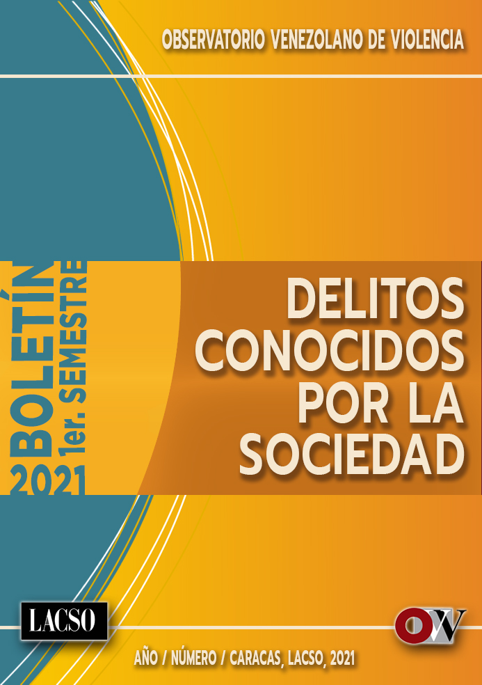

--- 
title: "Boletín primer semestre de 2021"
author: "LACSO-OVV"
date: ""
site: bookdown::bookdown_site
output: bookdown::gitbook
documentclass: book
bibliography: [book.bib, packages.bib]
biblio-style: apalike
csl: apa.csl
link-citations: yes
github-repo: rstudio/bookdown-demo
description: ""
cover-image: "images/PORTADA_BOLETIN_SEMESTRAL2.jpg"

---

```{r officedown, include=FALSE}
library(officedown)
library(officer)

```



# LACSO-OVV {-}


```{r fig.align='center', echo=FALSE, include=identical(knitr:::pandoc_to(), 'html'), fig.link='https://observatoriodeviolencia.org.ve/news/informe-semestral-regional-de-violencia-2021-guarico/'}
knitr::include_graphics('images/PORTADA_BOLETIN_SEMESTRAL2.jpg', dpi = NA)
```

```{r victimasdelhiedadsexo, results='hide',echo=FALSE,message=FALSE, warning=FALSE,cache=F}
source("victimasdelito.R", echo = F,local = knitr::knit_global())
```

```{r sucesos, results='hide',echo=FALSE,message=FALSE, warning=FALSE,cache=F}
source("sucesos.R", echo = F,local = knitr::knit_global())
```

```{r victimasmil, results='hide',echo=FALSE,message=FALSE, warning=FALSE,cache=F}
source("victimasMIL.R", echo = F,local = knitr::knit_global())
```
